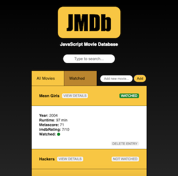

# Fullstack Movie Database

Fullstack app with full CRUD functionality that persists and displays updated movie data after each action. Built with the SERN stack using MySQL.

## Setup:

1. `git clone`
1. install dependencies with `npm install`
1. add `.env` file to root directory with MySQL credentials, then seed database with `schema.sql` file
1. start server with `npm run start`
1. build bundle with `npm run build`
1. verify app up and running at `localhost:3000`
1. for development, start webpack with `npm run react-dev`
